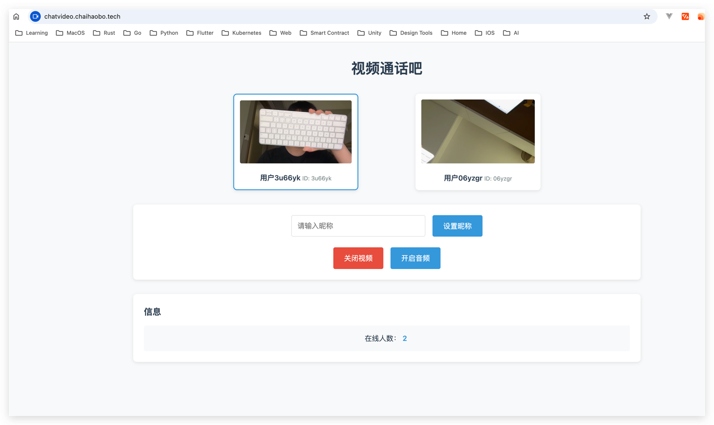

# WebRTC 视频通话

一个基于WebRTC的实时视频通话应用，支持局域网和公网视频通话。



## ✨ 特性

- 🎥 实时视频通话
- 🎤 音频通话
- 👤 自定义昵称
- 🔄 自动重连
- 🌐 支持局域网和公网通信
- 🔒 安全通信
- 📱 响应式设计

## 🚀 快速开始

### 环境要求

- Node.js >= 14.0.0
- 现代浏览器（Chrome、Firefox、Safari、Edge）
- 摄像头和麦克风设备

### 安装

1. 克隆仓库
```bash
git clone [repository-url]
cd webrtc-video-chat
```

2. 安装依赖
```bash
npm install
```

3. 生成SSL证书
```bash
chmod +x generate-cert.sh
./generate-cert.sh
```

### 运行

1. 启动服务器
```bash
npm start
```

2. 访问应用
- 打开浏览器访问 `https://localhost:3000`
- 允许浏览器访问摄像头和麦克风
- 在另一个浏览器窗口访问相同地址

## 💻 使用说明

1. 设置昵称（可选）
   - 在输入框中输入你想要的昵称
   - 点击"设置昵称"按钮

2. 开始通话
   - 点击"开始通话"按钮
   - 允许浏览器访问摄像头和麦克风
   - 等待连接建立

3. 控制功能
   - 开启/关闭视频
   - 开启/关闭音频
   - 查看在线人数

## 🌐 网络支持

### 局域网模式
- 在同一局域网内直接连接
- 无需额外配置
- 低延迟通信

### 公网模式
- 支持通过公网IP或域名访问
- 使用STUN/TURN服务器进行NAT穿透
- 支持以下场景：
  - 不同局域网之间的连接
  - 通过互联网远程连接
  - 移动网络连接

## 🔧 技术栈

- **前端**
  - WebRTC API
  - 现代CSS (Grid/Flexbox)
  - 原生JavaScript

- **后端**
  - Node.js
  - WebSocket
  - Express
  - HTTPS
  - STUN/TURN服务器

## 📱 浏览器支持

| 浏览器 | 最低版本 |
|--------|----------|
| Chrome | 60+      |
| Firefox| 55+      |
| Safari | 11+      |
| Edge   | 79+      |

## ⚠️ 注意事项

- 确保浏览器已授予摄像头和麦克风权限
- 公网模式下需要配置STUN/TURN服务器
- 首次访问时浏览器会显示安全警告（自签名证书）
- 目前仅支持点对点连接

## 🔍 项目结构

```
webrtc-video-chat/
├── index.html          # 主页面
├── styles.css          # 样式文件
├── script.js           # 前端逻辑
├── server.js           # 信令服务器
├── generate-cert.sh    # SSL证书生成脚本
└── package.json        # 项目配置
```

## 🤝 贡献

欢迎提交 Issue 和 Pull Request！

## �� 许可证

MIT License 